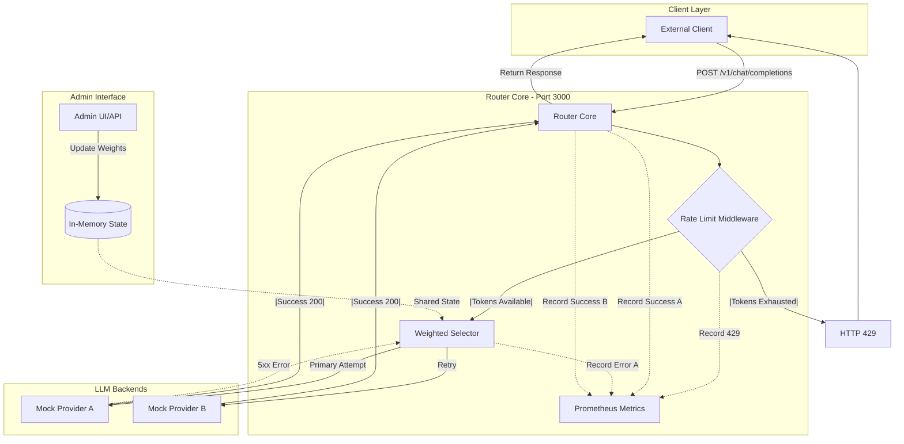

# AI-Powered LLM Router

A **high-performance, resilient LLM routing gateway** built in **Go**.  
This project exposes a **unified OpenAI-compatible API** that intelligently routes requests across multiple LLM providers with **rate limiting**, **weighted load balancing**, and **automatic failover**.

---

## Key Features

- **OpenAI-Compatible API** (`/v1/chat/completions`)
- **Weighted Load Balancing** across multiple providers
- **Automatic Failover** on provider errors (5xx)
- **Rate Limiting** with HTTP `429` rejection
- **Prometheus Metrics** for observability
- **Admin Interface** for runtime configuration
- **Docker & Kubernetes Ready**

---
## Testing & Validation

### Postman
A pre-configured Postman collection is included in the root directory: `postman_collection.json`.
1. **Import** the file into Postman.
2. **Environment**: Ensure your router is running at `http://localhost:3000`.
3. **Requests**:
    * `Chat Completion`: Tests the core proxy and deterministic selection.
    * `Get Cluster Stats`: Verifies the Admin API and current weights.
    * `Update Weights`: Tests the Hot-Reloading capability.

---
##  Architecture Overview

The router sits between clients and multiple LLM backends, acting as a smart gateway that enforces limits, routes traffic, and ensures resiliency.

### Request Lifecycle Diagram



---
## Folder Structure
```
    LLM-ROUTER/
    ├── admin/                  # Web Dashboard assets (index.html)
    ├── cmd/
    │   └── router/
    │       └── main.go         # Service entry point & graceful shutdown logic
    ├── internal/
    │   ├── config/
    │   │   └── config.go       # Deterministic weighted selection logic
    │   ├── handler/
    │   │   ├── admin_handler.go  # Handlers for stats, config, and metrics reset
    │   │   └── router_handler.go # Core LLM proxy and failover logic
    │   ├── middleware/
    │   │   └── limit.go        # Redis-backed distributed rate limiter
    │   └── router/
    │       └── router.go       # Route definitions & HTTP client optimization
    ├── k8s/                    # Kubernetes manifests (deployments, services)
    ├── mock/
    │   ├── Dockerfile          # Container definition for mock providers
    │   └── main.go             # Mock LLM provider implementation
    ├── .env                    # Environment configuration
    ├── docker-compose.yml      # Local orchestration stack
    ├── Dockerfile              # Container definition for the main Router
    ├── go.mod                  # Go module dependencies
    ├── locust.py               # Performance & load testing script
    └── postman_collection.json   # Postman collection for API testing
```
---
## Local Development (Docker Compose)

Run the full environment locally, including the router and two mock LLM providers.

### Prerequisites

- Docker & Docker Compose
- Go 1.24+ (only required if running outside Docker)

### Steps

#### Initialize Go Modules

go mod tidy

docker-compose up --build

## Kubernetes Deployment

Deploy the router to a local Kubernetes cluster using **Minikube**.

### Steps

#### 1. Point Docker to the Cluster
This configures your terminal to build images directly inside the Minikube environment.
```bash
eval $(minikube docker-env)
docker build -t llm-router:latest .
kubectl apply -f k8s/
minikube service llm-router-service
```
## Limitations
While this router is high-performance, users should be aware of the following architectural constraints:
- **Deterministic Window Reset: The weighted selection counter is held in memory per pod; if a pod restarts, its local requestCount resets to zero.**
- **Weight Granularity: Selection is currently calculated based on a 100-request window; weights smaller than $1\%$ (e.g., $0.5\%$) will be rounded down or ignored depending on the total weight.**
- **Failover Context: The current failover logic does not pass the specific error message from Provider A to Provider B; it simply attempts a fresh request to the next healthy backend.**
- **Redis Dependency: If RATE_LIMIT_ENABLED is true, the router requires a healthy Redis connection to process requests; if Redis latency spikes, it will directly impact API response times.**

## Day 2 Operations
Day 2 operations focus on maintaining, monitoring, and scaling the system after it is live in production.
### Monitoring & Observability
- **Metric Scraping: Ensure Prometheus is configured to scrape the /metrics endpoint every 15 seconds to track p99 latency and error rates.**
- **Alerting: Set up alerts for http_requests_total where status="429" (Global Limit reached) or status="5xx" (Provider failure)**.
### Scaling
- **Horizontal Scaling: You can scale the router to $N$ replicas using kubectl scale deployment llm-router --replicas=N. The Redis-backed rate limiter ensures the global limit is respected across all $N$ pods.**
- **Connection Tuning: If scaling to a high number of users, monitor the MaxIdleConnsPerHost setting in internal/router/router.go to prevent socket exhaustion.**
### Configuration Updates
- **Hot-Reloading: Use the Admin UI or POST /admin/config to shift traffic weights in real-time. For example, use this to slowly bleed traffic off a provider that is experiencing high latency.**
- **Kill Switch: If a specific LLM provider goes offline, set its active status to false in the config to remove it from the rotation immediately without a redeployment.**
###̌ Maintenance
- **Redis Cleanup: The rate limiter uses a 2-second TTL for keys; however, ensure Redis memory usage is monitored to prevent evictions of other critical data.**
- **Log Rotation: If running in high-traffic mode, ensure GIN_MODE=release is set to reduce log volume and disk I/O.**