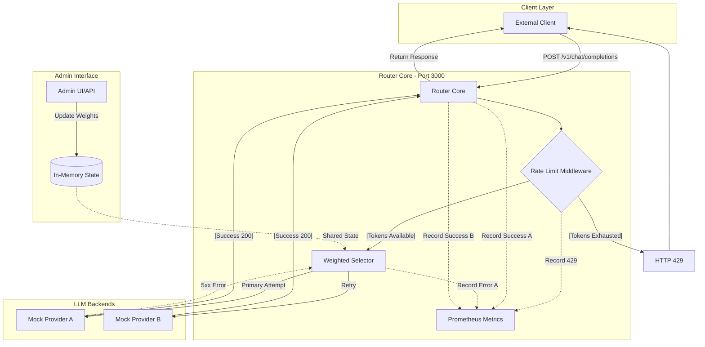

# AI-Powered LLM Router

A **high-performance, resilient LLM routing gateway** built in **Go**.  
This project exposes a **unified OpenAI-compatible API** that intelligently routes requests across multiple LLM providers with **rate limiting**, **weighted load balancing**, and **automatic failover**.

---

## Key Features

- **OpenAI-Compatible API** (`/v1/chat/completions`)
- **Weighted Load Balancing** across multiple providers
- **Automatic Failover** on provider errors (5xx)
- **Rate Limiting** with HTTP `429` rejection
- **Prometheus Metrics** for observability
- **Admin Interface** for runtime configuration
- **Docker & Kubernetes Ready**

---

##  Architecture Overview

The router sits between clients and multiple LLM backends, acting as a smart gateway that enforces limits, routes traffic, and ensures resiliency.

### Request Lifecycle Diagram

## Local Development (Docker Compose)

Run the full environment locally, including the router and two mock LLM providers.

### Prerequisites

- Docker & Docker Compose
- Go 1.24+ (only required if running outside Docker)

### Steps

#### Initialize Go Modules

go mod tidy

docker-compose up --build

## Kubernetes Deployment

Deploy the router to a local Kubernetes cluster using **Minikube** or **Kind**.

### Steps

#### Point Docker to the Cluster

eval $(minikube docker-env)
Build the Image
docker build -t llm-router:latest .
Apply Kubernetes Manifests
kubectl apply -f k8s/

Access the Service
minikube service llm-router-service

